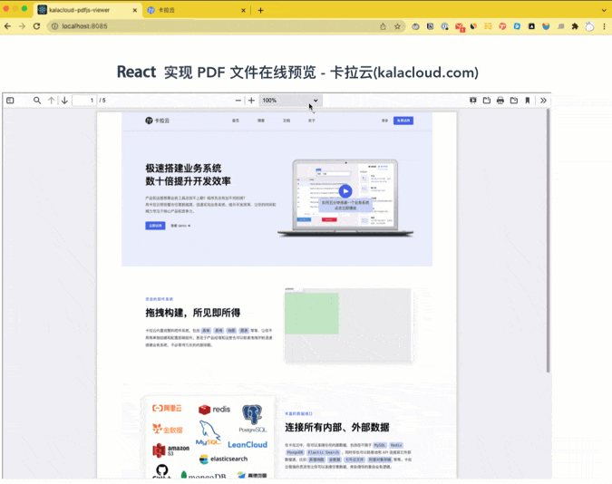

# React 实现 PDF 文件在线预览 - 手把手教你写 React PDF 预览功能

本代码套教程请访问卡拉云技术博客：《[React 实现 PDF 文件在线预览 - 手把手教你写 React PDF 预览功能）](https://kalacloud.com/blog/how-build-react-pdf-viewer-pdfjs/)》

很多 React 项目中都需要 PDF 文件预览功能，比如合同 ERP，销售CRM，内部文档CMS管理系统，内置 PDF 文件在线预览功能。本文手把手教你搭建一套 PDF 预览组件嵌入到 React 项目中，实现 PDF 文件在线预览等 PDF 预览的所有常见功能。

跟随本教程学习完成后，你会搭出以下 PDF 在线预览效果的 React PDF 预览组件

